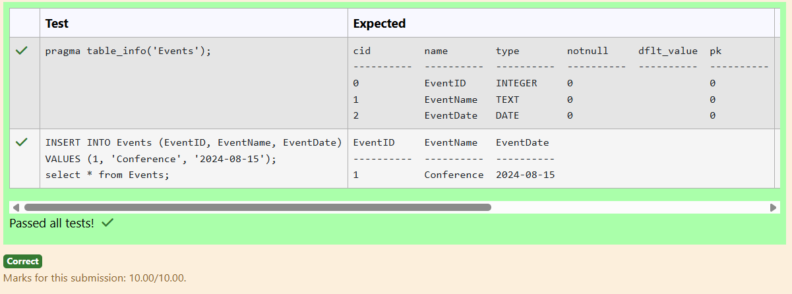
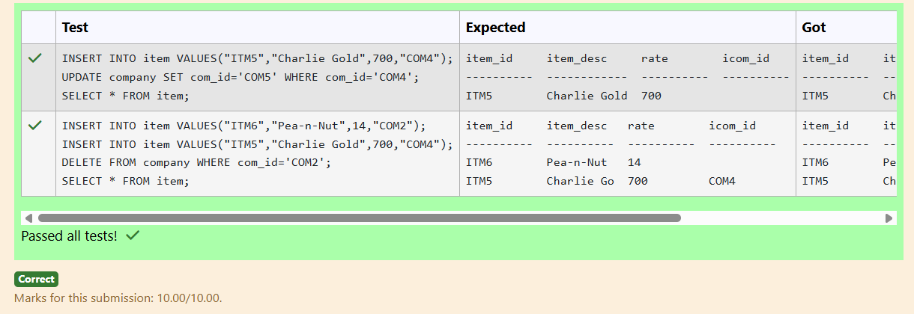
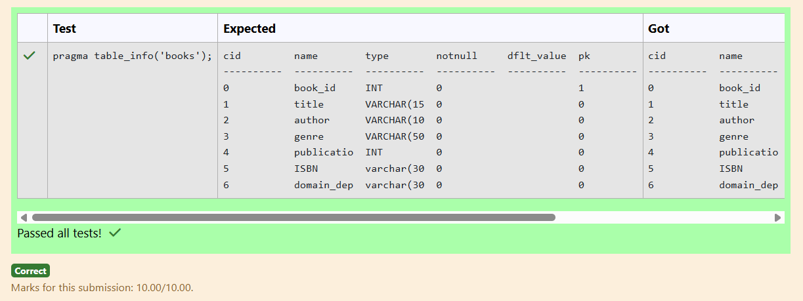
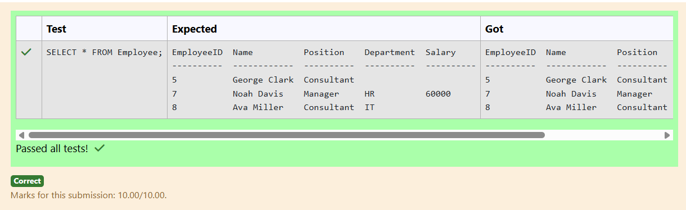
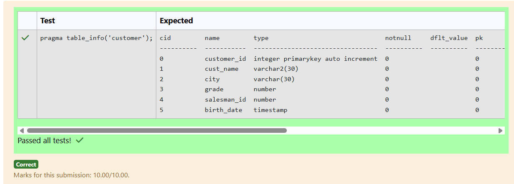
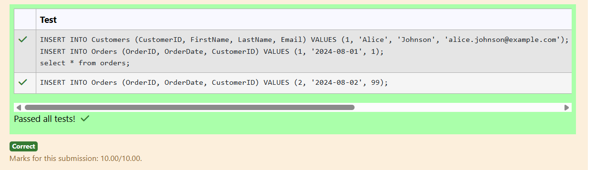
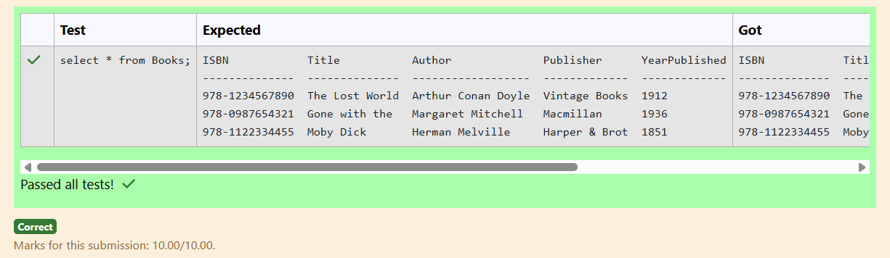
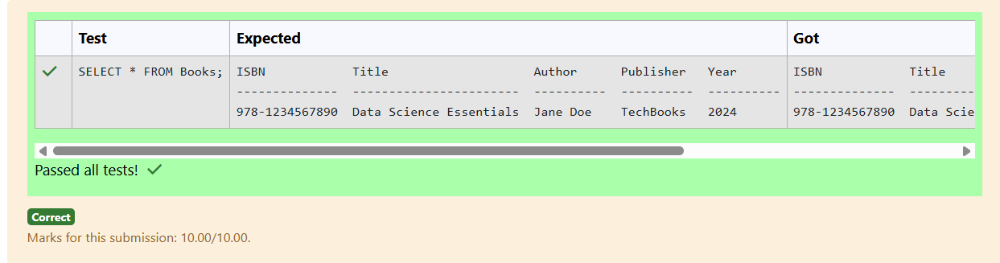
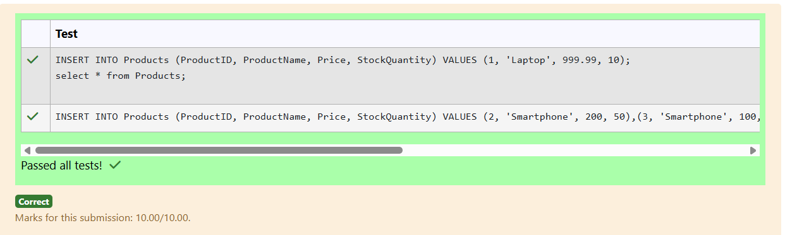
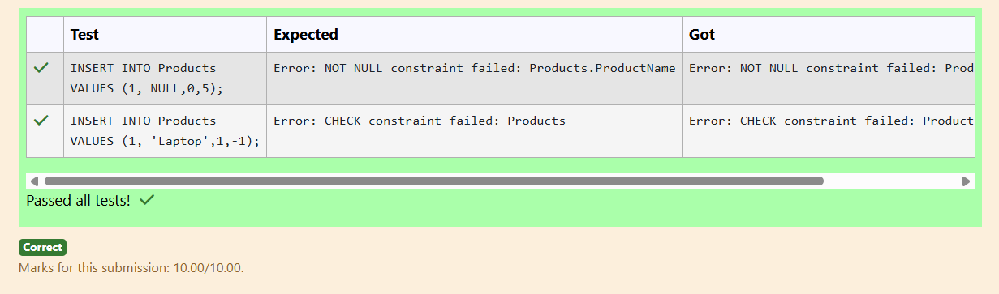

# Experiment 2: DDL Commands

## AIM
To study and implement DDL commands and different types of constraints.

## THEORY

### 1. CREATE
Used to create a new relation (table).

**Syntax:**
```sql
CREATE TABLE (
  field_1 data_type(size),
  field_2 data_type(size),
  ...
);
```
### 2. ALTER
Used to add, modify, drop, or rename fields in an existing relation.
(a) ADD
```sql
ALTER TABLE std ADD (Address CHAR(10));
```
(b) MODIFY
```sql
ALTER TABLE relation_name MODIFY (field_1 new_data_type(size));
```
(c) DROP
```sql
ALTER TABLE relation_name DROP COLUMN field_name;
```
(d) RENAME
```sql
ALTER TABLE relation_name RENAME COLUMN old_field_name TO new_field_name;
```
### 3. DROP TABLE
Used to permanently delete the structure and data of a table.
```sql
DROP TABLE relation_name;
```
### 4. RENAME
Used to rename an existing database object.
```sql
RENAME TABLE old_relation_name TO new_relation_name;
```
### CONSTRAINTS
Constraints are used to specify rules for the data in a table. If there is any violation between the constraint and the data action, the action is aborted by the constraint. It can be specified when the table is created (using CREATE TABLE) or after it is created (using ALTER TABLE).
### 1. NOT NULL
When a column is defined as NOT NULL, it becomes mandatory to enter a value in that column.
Syntax:
```sql
CREATE TABLE Table_Name (
  column_name data_type(size) NOT NULL
);
```
### 2. UNIQUE
Ensures that values in a column are unique.
Syntax:
```sql
CREATE TABLE Table_Name (
  column_name data_type(size) UNIQUE
);
```
### 3. CHECK
Specifies a condition that each row must satisfy.
Syntax:
```sql
CREATE TABLE Table_Name (
  column_name data_type(size) CHECK (logical_expression)
);
```
### 4. PRIMARY KEY
Used to uniquely identify each record in a table.
Properties:
Must contain unique values.
Cannot be null.
Should contain minimal fields.
Syntax:
```sql
CREATE TABLE Table_Name (
  column_name data_type(size) PRIMARY KEY
);
```
### 5. FOREIGN KEY
Used to reference the primary key of another table.
Syntax:
```sql
CREATE TABLE Table_Name (
  column_name data_type(size),
  FOREIGN KEY (column_name) REFERENCES other_table(column)
);
```
### 6. DEFAULT
Used to insert a default value into a column if no value is specified.

Syntax:
```sql
CREATE TABLE Table_Name (
  col_name1 data_type,
  col_name2 data_type,
  col_name3 data_type DEFAULT 'default_value'
);
```

**Question 1**
--
Create a table named Events with the following columns:

EventID as INTEGER
EventName as TEXT
EventDate as DATE
```sql
CREATE TABLE Events(
EventID INTEGER,
EventName TEXT,
EventDate DATE)
```

**Output:**



**Question 2**
---
Create a new table named item with the following specifications and constraints:
item_id as TEXT and as primary key.
item_desc as TEXT.
rate as INTEGER.
icom_id as TEXT with a length of 4.
icom_id is a foreign key referencing com_id in the company table.
The foreign key should set NULL on updates and deletes.
item_desc and rate should not accept NULL.
```sql
CREATE TABLE item(
item_id TEXT PRIMARY KEY,
item_desc TEXT NOT NULL,
rate INTEGER NOT NULL,
icom_id TEXT(4),
FOREIGN KEY (icom_id) REFERENCES company (com_id) on UPDATE SET NULL ON DELETE SET NULL);
```

**Output:**



**Question 3**
---
Write a SQL Query  to add attribute ISBN as varchar(30) and domain_dept as varchar(30) in the table 'books'

```sql
ALTER TABLE books 
ADD COLUMN ISBN varchar(30); 
ALTER TABLE books
ADD COLUMN domain_dept varchar(30);
```

**Output:**



**Question 4**
---
In the Employee table, insert a record where some fields are NULL, another record where all fields are filled without any NULL values, and a third record where some fields are filled, and others are left as NULL.

```sql
INSERT INTO Employee (EmployeeID, Name, Position, Department, Salary) VALUES (5, 'George Clark', 'Consultant', NOT NULL, NOT NULl);
INSERT INTO Employee (EmployeeID, Name, Position, Department, Salary) VALUES (7, 'Noah Davis', 'Manager', 'HR', 60000);
INSERT INTO Employee (EmployeeID, Name, Position, Department, Salary) VALUES (8, 'Ava Miller', 'Consultant', 'IT', NULL);
```

**Output:**



**Question 5**
---
Write a SQL query to add birth_date attribute as timestamp (datatype) in the table customer 

```sql
ALTER TABLE customer ADD COLUMN birth_date timestamp;
```

**Output:**



**Question 6**
---
Create a table named Orders with the following constraints:
OrderID as INTEGER should be the primary key.
OrderDate as DATE should be not NULL.
CustomerID as INTEGER should be a foreign key referencing Customers(CustomerID).

```sql
CREATE TABLE Orders(
OrderID INTEGER PRIMARY KEY,
OrderDate DATE NOT NULL,
CustomerID INTEGER,
FOREIGN KEY (CustomerID) REFERENCES Customers(CustomerID));
```

**Output:**



**Question 7**
---
Insert all books from Out_of_print_books into Books

Table attributes are ISBN, Title, Author, Publisher, YearPublished
```sql
INSERT INTO Books SELECT * FROM out_of_print_books; 
```

**Output:**



**Question 8**
---
Insert a book with ISBN 978-1234567890, Title Data Science Essentials, Author Jane Doe, Publisher TechBooks, and Year 2024 into the Books table.

```sql
INSERT INTO Books (ISBN, Title, Author, Publisher, Year) VALUES('978-1234567890', 'Data Science Essentials', 'Jane Doe', 'TechBooks', 2024);
```

**Output:**



**Question 9**
---
Create a table named Products with the following constraints:
ProductID as INTEGER should be the primary key.
ProductName as TEXT should be unique and not NULL.
Price as REAL should be greater than 0.
StockQuantity as INTEGER should be non-negative.
```sql
CREATE TABLE Products(
ProductID INTEGER PRIMARY KEY,
ProductName TEXT UNIQUE NOT NULL,
Price REAL CHECK (Price > 0),
StockQuantity INTEGER CHECK (StockQuantity >= 0));
```

**Output:**



**Question 10**
---
Create a table named Products with the following constraints:

ProductID should be the primary key.
ProductName should be NOT NULL.
Price is of real datatype and should be greater than 0.
Stock is of integer datatype and should be greater than or equal to 0.

```sql
CREATE TABLE Products(
ProductID INTEGER PRIMARY KEY,
ProductName NOT NULL,
Price REAL CHECK(Price > 0),
Stock INTEGER CHECK (Stock >= 0));
```

**Output:**




## RESULT
Thus, the SQL queries to implement different types of constraints and DDL commands have been executed successfully.
