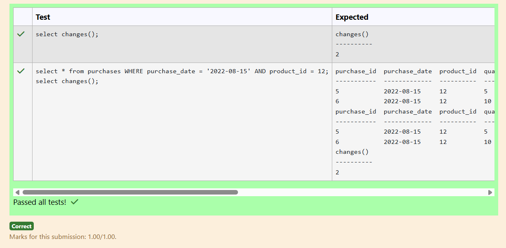
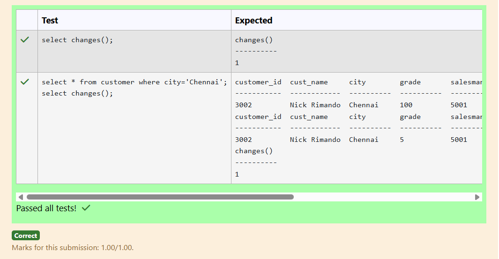
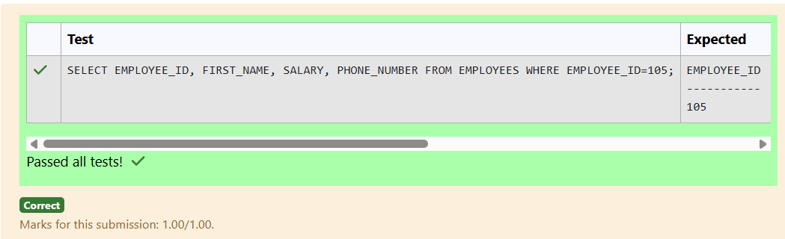
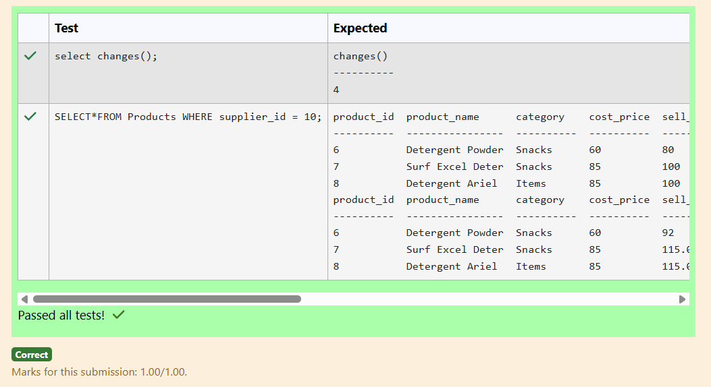
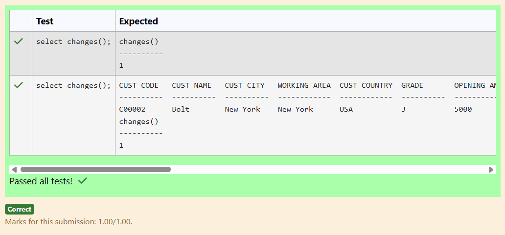
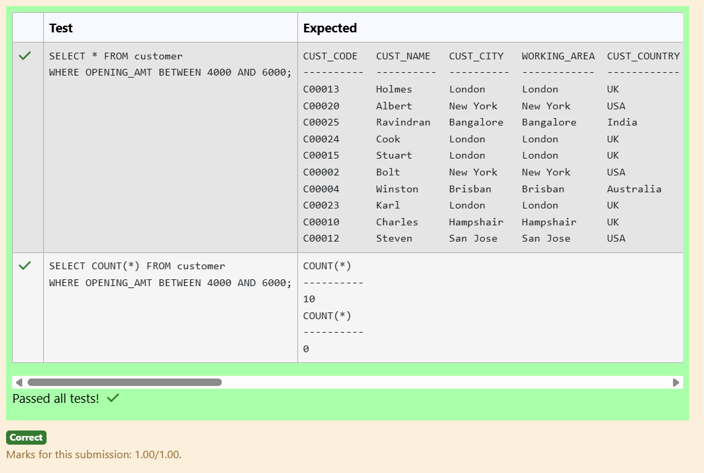
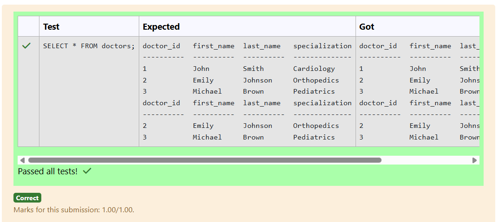
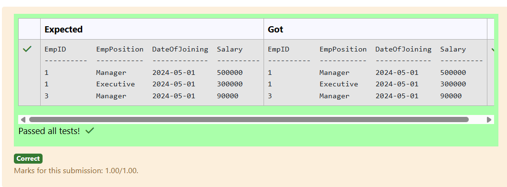
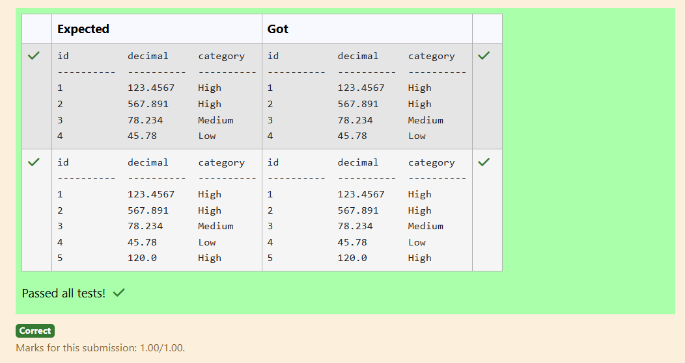
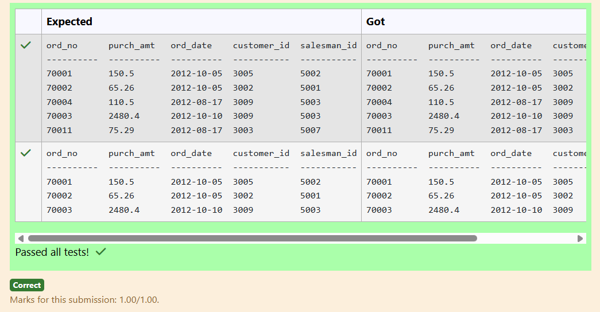

# Experiment 3: DML Commands

## AIM
To study and implement DML (Data Manipulation Language) commands.

## THEORY

### 1. INSERT INTO
Used to add records into a relation.
These are three type of INSERT INTO queries which are as
A)Inserting a single record
**Syntax (Single Row):**
```sql
INSERT INTO table_name (field_1, field_2, ...) VALUES (value_1, value_2, ...);
```
**Syntax (Multiple Rows):**
```sql
INSERT INTO table_name (field_1, field_2, ...) VALUES
(value_1, value_2, ...),
(value_3, value_4, ...);
```
**Syntax (Insert from another table):**
```sql
INSERT INTO table_name SELECT * FROM other_table WHERE condition;
```
### 2. UPDATE
Used to modify records in a relation.
Syntax:
```sql
UPDATE table_name SET column1 = value1, column2 = value2 WHERE condition;
```
### 3. DELETE
Used to delete records from a relation.
**Syntax (All rows):**
```sql
DELETE FROM table_name;
```
**Syntax (Specific condition):**
```sql
DELETE FROM table_name WHERE condition;
```
### 4. SELECT
Used to retrieve records from a table.
**Syntax:**
```sql
SELECT column1, column2 FROM table_name WHERE condition;
```
**Question 1**
--
Write a SQL statement to Update the per_unit_price to 25 and total_price accordingly in purchases table where purchase_date is '2022-08-15' and product_id is 12.


```sql
UPDATE purchases SET per_unit_price = 25, total_price = 25 * quantity WHERE purchase_date = '2022-08-15' AND product_id =12;
```

**Output:**



**Question 2**
---
Write a SQL statement to Update the grade of all customers in Chennai city as  5. 
```sql
UPDATE Customer SET grade = 5 WHERE city = 'Chennai';
```

**Output:**



**Question 3**
---
Write a SQL statement to change salary of employee to 8000 whose Employee ID is 105, if the existing salary is less than 5000.

```sql
UPDATE Employees SET salary = 8000 WHERE employee_id = 105 AND salary < 5000;
```

**Output:**



**Question 4**
---
Write a SQL statement to Increase the selling price by 15% in the products table where quantity in stock is less than 50 and supplier ID is 10.
```sql
UPDATE Products SET sell_price = sell_price * 1.15 WHERE quantity < 50 AND supplier_id = 10;
```

**Output:**



**Question 5**
---
Write a SQL query to Delete customers with 'GRADE' 3 or 'AGENT_CODE' 'A008' whose 'OUTSTANDING_AMT' is less than 5000
```sql
DELETE FROM Customer WHERE (GRADE = 3 OR AGENT_CODE = 'A008') AND OUTSTANDING_AMT < 5000;
```

**Output:**



**Question 6**
---
Write a SQL query to Delete customers from 'customer' table where 'OPENING_AMT' is between 4000 and 6000.

```sql
DELETE FROM Customer WHERE OPENING_AMT BETWEEN 4000 AND 6000;
```

**Output:**



**Question 7**
---
Write a SQL query to delete a doctor from Doctors table whos specialization is 'Cardiology'
```sql
DELETE FROM Doctors WHERE specialization = 'Cardiology';
```

**Output:**



**Question 8**
---
 Write a query to fetch 3 top salaried records from EmployeePosition table.
```sql
SELECT * FROM EmployeePosition ORDER BY Salary DESC LIMIT 3;
```

**Output:**



**Question 9**
---
Write a SQL query to categorize decimal as 'High', 'Medium', or 'Low' based on whether it is greater than 100, between 50 and 100, or less than 50 in the Calculations table
```sql
SELECT id, decimal,
CASE
WHEN decimal > 100 THEN 'High'
WHEN decimal >= 50 AND decimal <= 100 THEN 'Medium'
ELSE 'Low'
END AS category
FROM calculations;
```

**Output:**



**Question 10**
---
write a SQL query to find details of all orders with a purchase amount less than 200 or exclude orders with an order date greater than or equal to '2012-02-10' and a customer ID less than 3009. Return ord_no, purch_amt, ord_date, customer_id and salesman_id.

```sql
SELECT ord_no, purch_amt, ord_date, customer_id, salesman_id
FROM orders
WHERE purch_amt < 200 OR NOT (ord_date >= '2012-02-10' AND customer_id < 3009);
```

**Output:**



## RESULT
Thus, the SQL queries to implement DML commands have been executed successfully.
