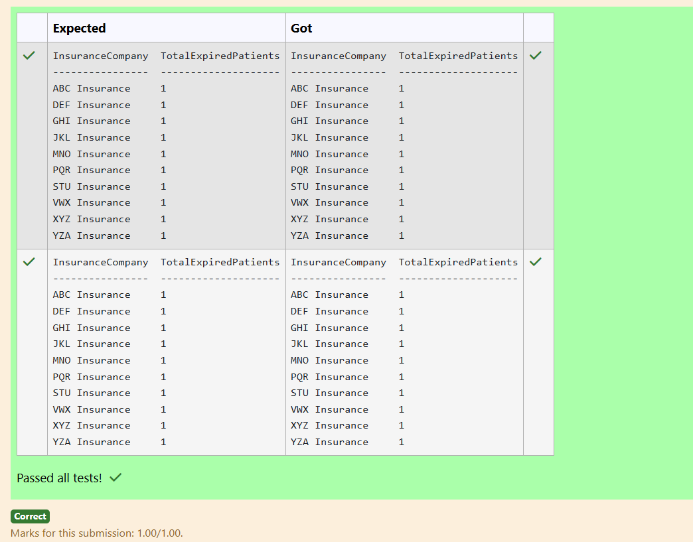
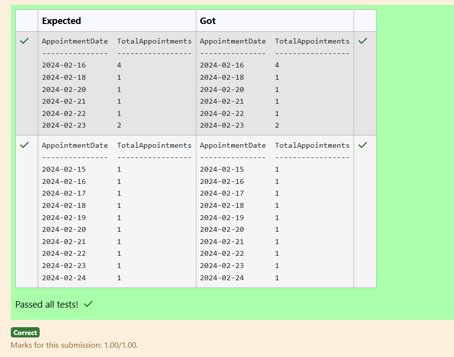
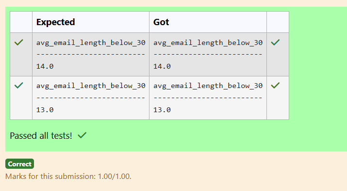
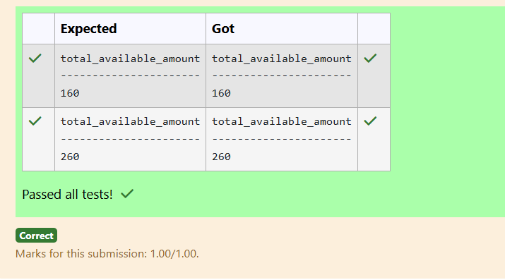
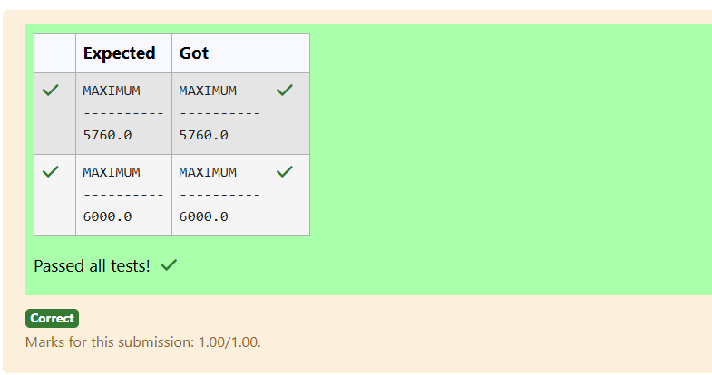
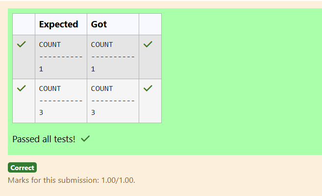
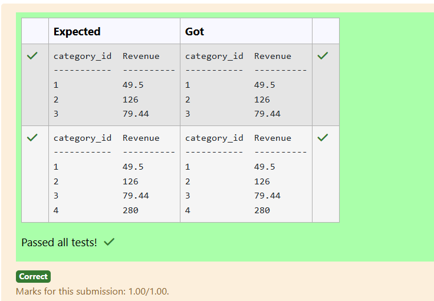
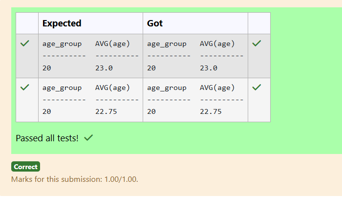
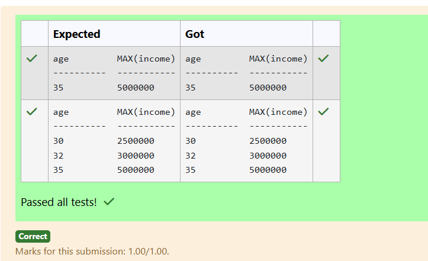

# Experiment 4: Aggregate Functions, Group By and Having Clause

## AIM
To study and implement aggregate functions, GROUP BY, and HAVING clause with suitable examples.

## THEORY

### Aggregate Functions
These perform calculations on a set of values and return a single value.

- **MIN()** – Smallest value  
- **MAX()** – Largest value  
- **COUNT()** – Number of rows  
- **SUM()** – Total of values  
- **AVG()** – Average of values

**Syntax:**
```sql
SELECT AGG_FUNC(column_name) FROM table_name WHERE condition;
```
### GROUP BY
Groups records with the same values in specified columns.
**Syntax:**
```sql
SELECT column_name, AGG_FUNC(column_name)
FROM table_name
GROUP BY column_name;
```
### HAVING
Filters the grouped records based on aggregate conditions.
**Syntax:**
```sql
SELECT column_name, AGG_FUNC(column_name)
FROM table_name
GROUP BY column_name
HAVING condition;
```

**Question 1**
--
How many patients have expired insurance coverage for each insurance company?
```sql
SELECT InsuranceCompany, COUNT(DISTINCT PatientID) AS TotalExpiredPatients
FROM Insurance
WHERE ValidityPeriod < CURRENT_DATE
GROUP BY InsuranceCompany;
```

**Output:**



**Question 2**
---
What is the total number of appointments scheduled for each day?
```sql
SELECT DATE(AppointmentDateTime) AS AppointmentDate, COUNT(*) AS TotalAppointments
FROM Appointments
GROUP BY DATE(AppointmentDateTime);
```

**Output:**



**Question 3**
---
How many male and female doctors are there in each medical specialty?

```sql
SELECT Specialty, Gender, COUNT(*) AS TotalDoctors 
FROM Doctors
GROUP BY Specialty, Gender
ORDER BY Specialty;
```

**Output:**


**Question 4**
---
Write a SQL query to Calculate the average email length (in characters) for people who lives in Mumbai city
```sql
SELECT AVG(LENGTH(email)) AS avg_email_length_below_30
FROM customer
WHERE city = 'Mumbai';
```

**Output:**



**Question 5**
---
Write a SQL query to calculate total available amount of fruits that has a price greater than 0.5 . Return total Count. 
```sql
SELECT SUM(inventory) AS total_available_amount
FROM fruits
WHERE price > 0.5;
```

**Output:**



**Question 6**
---
Write a SQL query to find the maximum purchase amount.
```sql
SELECT max(purch_amt) AS MAXIMUM
FROM orders;
```

**Output:**



**Question 7**
---
Write a SQL query to return the total number of rows in the 'customer' table where the city is Noida.
```sql
SELECT COUNT(*) AS COUNT 
FROM customer
WHERE city='Noida';
```

**Output:**



**Question 8**
---
Write the SQL query that achieves the selection of category and calculates the sum of the product of price and category ID as Revenue for each category from the "products" table, and includes only those products where the total revenue is greater than 25.

```sql
SELECT category_id, SUM(price * category_id) AS Revenue
FROM products
GROUP BY category_id
HAVING SUM(price * category_id) > 25;
```

**Output:**



**Question 9**
---
Write the SQL query that achieves the grouping of data by age intervals using the expression (age/5)5, calculates the average age for each group, and excludes groups where the average age is not less than 24.
```sql
SELECT (age/5)*5 AS age_group, AVG(age) 
FROM customer1
GROUP BY age_group
HAVING AVG(age) < 24;
```

**Output:**



**Question 10**
---
Write the SQL query that accomplishes the grouping of data by age, calculates the maximum income for each age group, and includes only those age groups where the maximum income is greater than 2,000,000.

```sql
SELECT age, MAX(income)
FROM employee
GROUP BY age
HAVING MAX(income) > 2000000;
```

**Output:**




## RESULT
Thus, the SQL queries to implement aggregate functions, GROUP BY, and HAVING clause have been executed successfully.
