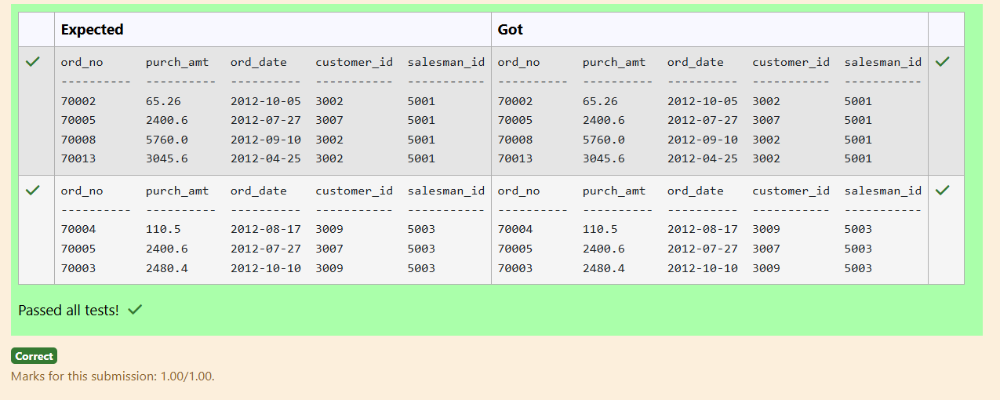
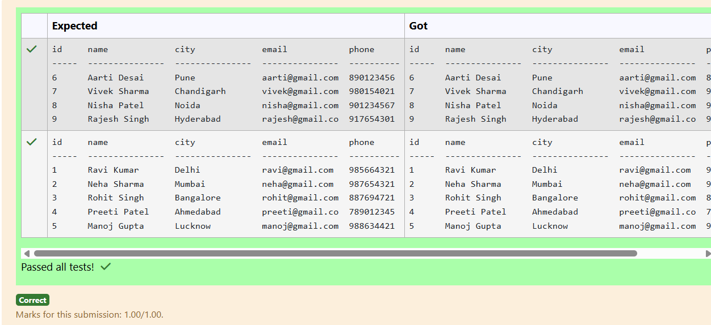
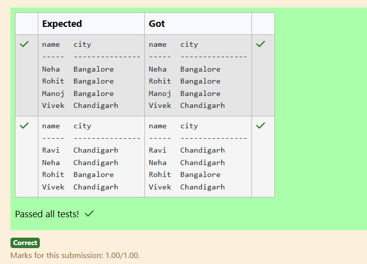
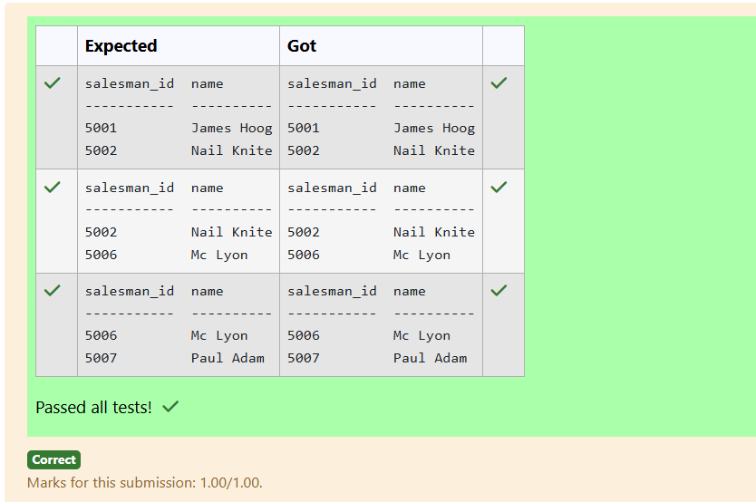
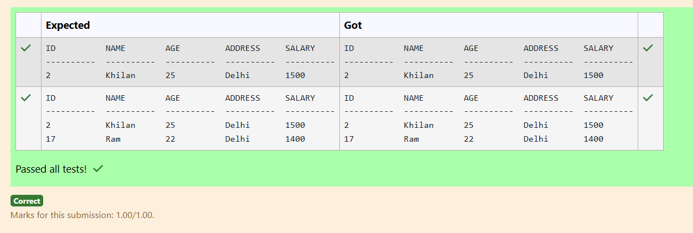
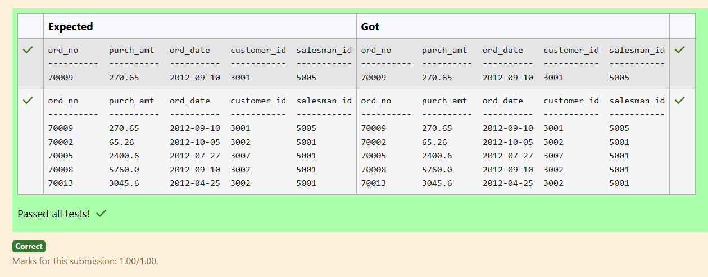
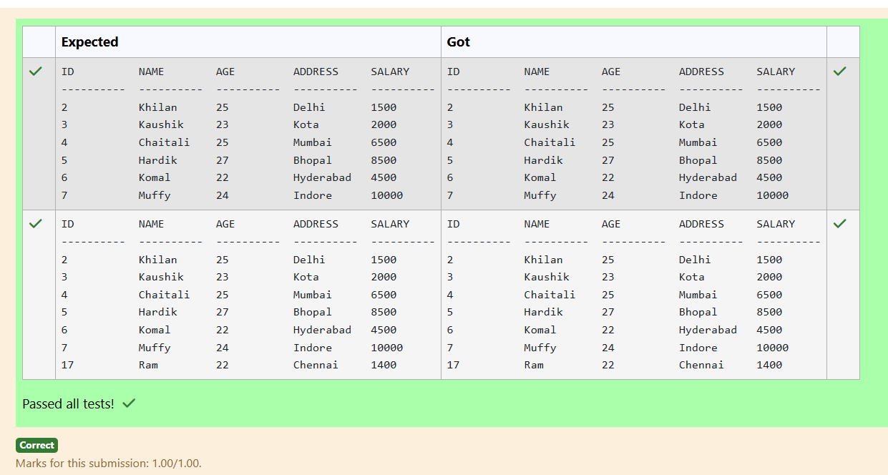
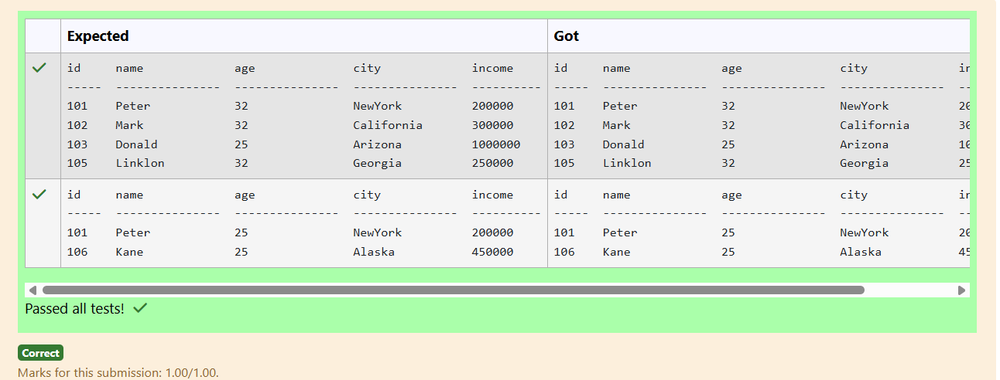
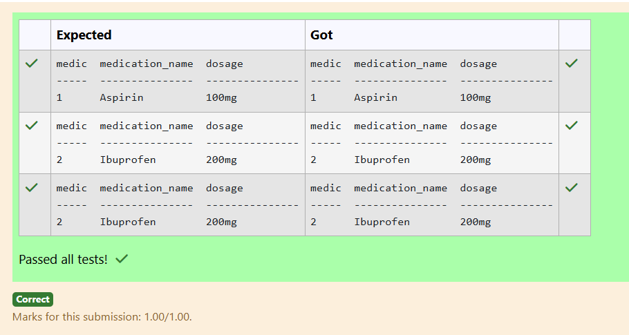
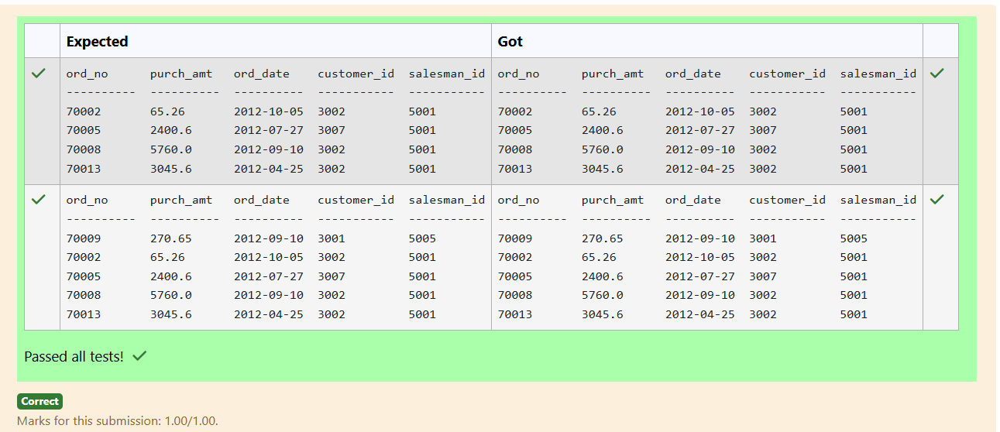

# Experiment 5: Subqueries and Views

## AIM
To study and implement subqueries and views.

## THEORY

### Subqueries
A subquery is a query inside another SQL query and is embedded in:
- WHERE clause
- HAVING clause
- FROM clause

**Types:**
- **Single-row subquery**:
  Sub queries can also return more than one value. Such results should be made use along with the operators in and any.
- **Multiple-row subquery**:
  Here more than one subquery is used. These multiple sub queries are combined by means of ‘and’ & ‘or’ keywords.
- **Correlated subquery**:
  A subquery is evaluated once for the entire parent statement whereas a correlated Sub query is evaluated once per row processed by the parent statement.

**Example:**
```sql
SELECT * FROM employees
WHERE salary > (SELECT AVG(salary) FROM employees);
```
### Views
A view is a virtual table based on the result of an SQL SELECT query.
**Create View:**
```sql
CREATE VIEW view_name AS
SELECT column1, column2 FROM table_name WHERE condition;
```
**Drop View:**
```sql
DROP VIEW view_name;
```

**Question 1**
--
From the following tables, write a SQL query to find all orders generated by the salespeople who may work for customers whose id is 3007. Return ord_no, purch_amt, ord_date, customer_id, salesman_id.

```sql
SELECT ord_no, purch_amt, ord_date, customer_id, salesman_id
FROM orders
WHERE salesman_id IN (
SELECT DISTINCT salesman_id
FROM orders
WHERE customer_id=3007);
```

**Output:**



**Question 2**
---
Write a SQL query to Identify customers whose city is different from the city of the customer with the highest ID

```sql
SELECT * FROM customer
WHERE city <> (
SELECT city
FROM customer
WHERE id=(
SELECT MAX(id)
FROM customer));
```

**Output:**



**Question 3**
---
Write a SQL query to Retrieve the names and cities of customers who have the same city as customers with IDs 3 and 7

```sql
SELECT name, city
FROM customer
WHERE city IN (
SELECT city
FROM customer
WHERE id IN (3,7));
```

**Output:**



**Question 4**
---
From the following tables write a SQL query to find salespeople who had more than one customer. Return salesman_id and name.

```sql
SELECT s.salesman_id, s.name
FROM salesman s
JOIN customer c
ON s.salesman_id = c.salesman_id
GROUP BY s.salesman_id, s.name
HAVING COUNT(c.customer_id)>1;
```

**Output:**



**Question 5**
---
Write a SQL query to retrieve all columns from the CUSTOMERS table for customers whose Address as Delhi

```sql
SELECT * FROM customers 
WHERE address = 'Delhi';
```

**Output:**



**Question 6**
---
From the following tables write a SQL query to find all orders generated by London-based salespeople. Return ord_no, purch_amt, ord_date, customer_id, salesman_id.

```sql
SELECT ord_no, purch_amt, ord_date, customer_id, salesman_id
FROM orders
WHERE salesman_id IN(
SELECT salesman_id
FROM salesman
WHERE city = 'London');
```

**Output:**



**Question 7**
---
Write a SQL query to retrieve all columns from the CUSTOMERS table for customers whose AGE is LESS than $30

```sql
SELECT * FROM customers
WHERE age < 30;
```

**Output:**



**Question 8**
---
Write a SQL query to Find employees who have an age less than the average age of employees with incomes over 1 million
```sql
SELECT * FROM Employee
WHERE age < (
SELECT AVG(age)
FROM Employee
WHERE income > 1000000);
```

**Output:**



**Question 9**
---
Write a SQL query to Retrieve the medications with dosages equal to the lowest dosage

Table Name: Medications (attributes: medication_id, medication_name, dosage)

```sql
SELECT * FROM Medications
WHERE dosage = (
SELECT MIN(dosage)
FROM Medications);
```

**Output:**



**Question 10**
---
From the following tables, write a SQL query to find all the orders generated in New York city. Return ord_no, purch_amt, ord_date, customer_id and salesman_id.
```sql
SELECT * FROM Orders
WHERE salesman_id IN (
SELECT salesman_id
FROM salesman
WHERE city = 'New York');
```

**Output:**




## RESULT
Thus, the SQL queries to implement subqueries and views have been executed successfully.
