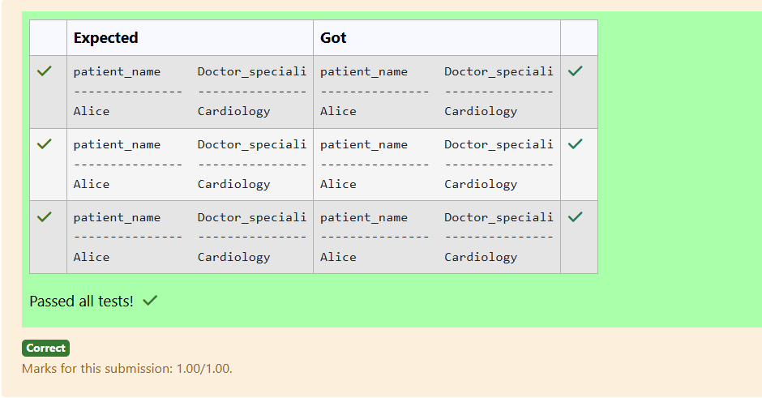
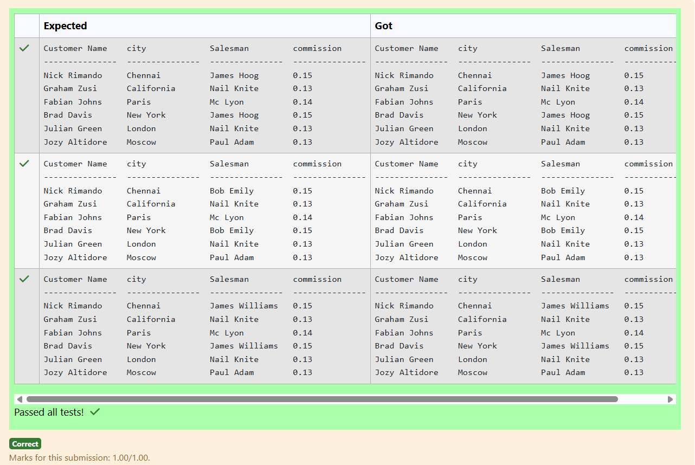
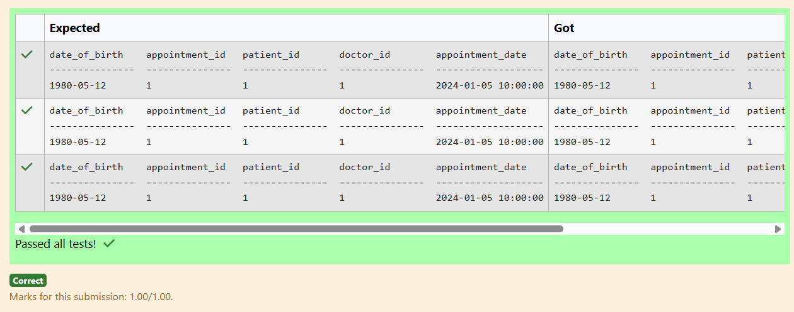
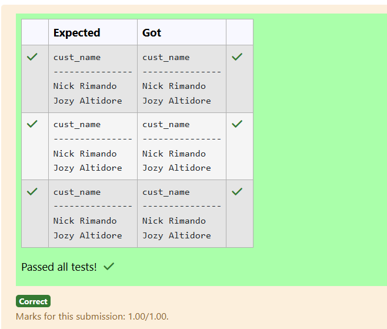
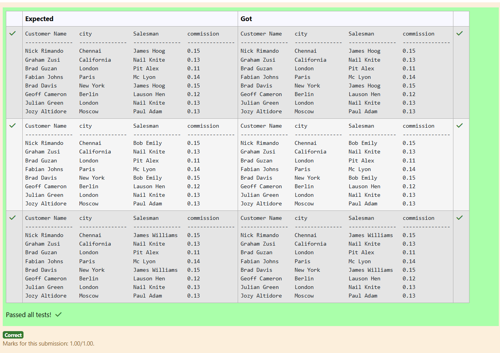
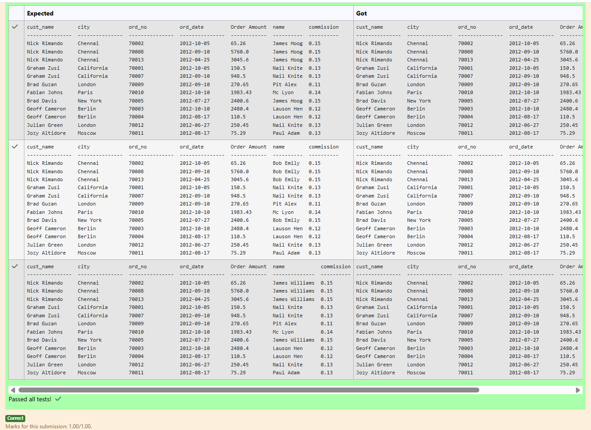
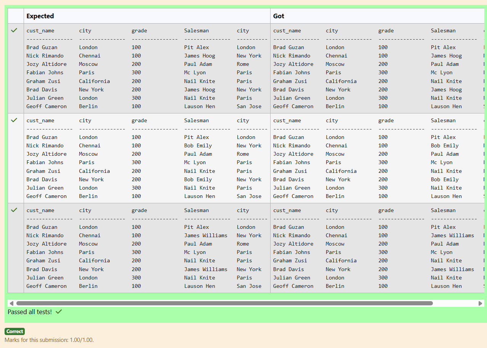
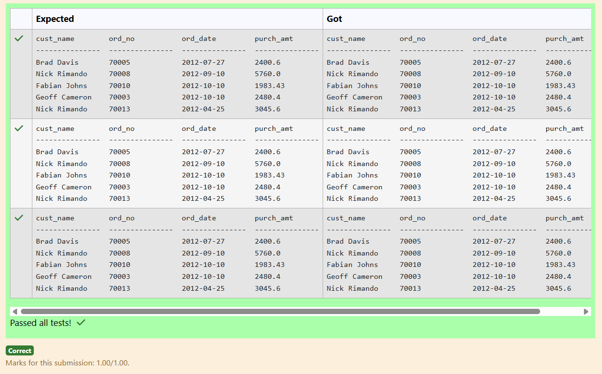
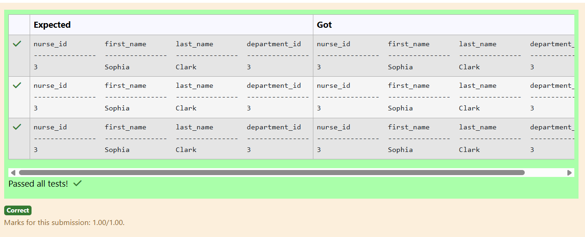
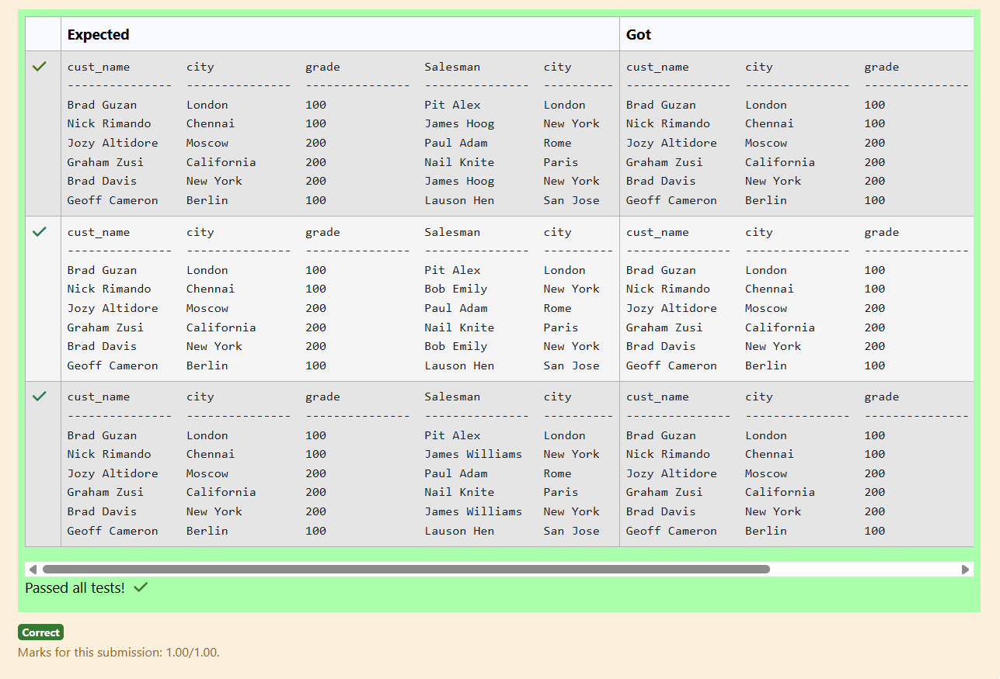

# Experiment 6: Joins

## AIM
To study and implement different types of joins.

## THEORY

SQL Joins are used to combine records from two or more tables based on a related column.

### 1. INNER JOIN
Returns records with matching values in both tables.

**Syntax:**
```sql
SELECT columns
FROM table1
INNER JOIN table2
ON table1.column = table2.column;
```

### 2. LEFT JOIN
Returns all records from the left table, and matched records from the right.

**Syntax:**

```sql
SELECT columns
FROM table1
LEFT JOIN table2
ON table1.column = table2.column;
```
### 3. RIGHT JOIN
Returns all records from the right table, and matched records from the left.

**Syntax:**

```sql
SELECT columns
FROM table1
RIGHT JOIN table2
ON table1.column = table2.column;
```
### 4. FULL OUTER JOIN
Returns all records when there is a match in either left or right table.

**Syntax:**

```sql
SELECT columns
FROM table1
FULL OUTER JOIN table2
ON table1.column = table2.column;
```

**Question 1**
--
Write the SQL query that achieves the selection of the first name from the "patients" table (aliased as "patient_name") and the specialization from the "doctors" table (aliased as "Doctor_specialization"), with an inner join on the "doctor_id" column and a condition filtering for patients admitted between '2024-01-01' and '2024-01-31'.

```sql
SELECT p.first_name AS patient_name, d.specialization AS Doctor_specialization
FROM patients p
INNER JOIN doctors d
ON p.doctor_id = d.doctor_id
WHERE p.admission_date BETWEEN '2024-01-01' AND '2024-01-31';
```

**Output:**



**Question 2**
---
 From the following tables write a SQL query to find salespeople who received commissions of more than 12 percent from the company. Return Customer Name, customer city, Salesman, commission.
```sql
SELECT c.cust_name AS 'Customer Name', c.city, s.name AS Salesman, s.commission
FROM customer c
INNER JOIN salesman s
ON c.salesman_id = s.salesman_id
WHERE s.commission  > 0.12;
```

**Output:**



**Question 3**
---
Write the SQL query that achieves the selection of the date of birth from the "patients" table (aliased as "p") and all columns from the "appointments" table (aliased as "a"), with an inner join on the "patient_id" column and a condition filtering for patients with the first name 'Alice'.

```sql
SELECT p.date_of_birth, a.appointment_id, a.patient_id, a.doctor_id, a.appointment_date
FROM patients p
INNER JOIN appointments a
ON p.patient_id = a.patient_id
WHERE p.first_name = 'Alice';
```

**Output:**



**Question 4**
---
Write the SQL query that achieves the selection of the "cust_name" column from the "customer" table (aliased as "c"), with a left join on the "customer_id" column and a condition filtering for orders with a purchase amount less than 100.

```
SELECT c.cust_name
FROM customer c
LEFT JOIN orders o
ON c.customer_id = o.customer_id
WHERE o.purch_amt < 100;
```

**Output:**



**Question 5**
---
 From the following tables write a SQL query to find the salesperson(s) and the customer(s) he represents. Return Customer Name, city, Salesman, commission.

```sql
SELECT c.cust_name AS 'Customer Name', c.city, s.name AS Salesman, s.commission
FROM customer c
JOIN salesman s
ON c.salesman_id = s.salesman_id;
```

**Output:**



**Question 6**
---
SQL statement to generate a report with customer name, city, order number, order date, order amount, salesperson name, and commission to determine if any of the existing customers have not placed orders or if they have placed orders through their salesman or by themselves.

```sql
SELECT c.cust_name, c.city, o.ord_no, o.ord_date, o.purch_amt AS 'Order Amount', s.name, s.commission
FROM customer c
LEFT JOIN orders o
ON c.customer_id = o.customer_id
LEFT JOIN salesman s
ON c.salesman_id = s.salesman_id;
```

**Output:**



**Question 7**
---
From the following tables write a SQL query to display the customer name, customer city, grade, salesman, salesman city. The results should be sorted by ascending customer_id. 

```sql
SELECT c.cust_name, c.city, c.grade, s.name AS Salesman, s.city
FROM customer c
JOIN salesman s
ON c.salesman_id = s.salesman_id
ORDER BY c.customer_id ASC;
```

**Output:**



**Question 8**
---
Write the SQL query that achieves the selection of the "cust_name" column from the "customer" table (aliased as "c"), and the "ord_no," "ord_date," and "purch_amt" columns from the "orders" table (aliased as "o"), with a left join on the "customer_id" column and a condition filtering for orders with a purchase amount greater than 1000.
```sql
SELECT c.cust_name, o.ord_no, o.ord_date, o.purch_amt
FROM customer c
LEFT JOIN orders o
ON c.customer_id = o.customer_id
WHERE o.purch_amt > 1000;
```

**Output:**



**Question 9**
---
Write the SQL query that achieves the selection of all columns from the "nurses" table (aliased as "n"), with an inner join on the "department_id" column and a condition filtering for nurses in the 'Pediatrics' department.
```sql
SELECT n.nurse_id, n.first_name, n.last_name, n.department_id
FROM nurses n
INNER JOIN departments d
ON n.department_id = d.department_id
WHERE d.department_name = 'Pediatrics';
```

**Output:**



**Question 10**
---
From the following tables write a SQL query to find those customers with a grade less than 300. Return cust_name, customer city, grade, Salesman, salesmancity. The result should be ordered by ascending customer_id. 

```sql
SELECT c.cust_name, c.city, c.grade, s.name AS Salesman, s.city
FROM customer c
JOIN salesman s
ON c.salesman_id = s.salesman_id
WHERE c.grade < 300
ORDER BY c.customer_id ASC;
```

**Output:**




## RESULT
Thus, the SQL queries to implement different types of joins have been executed successfully.
